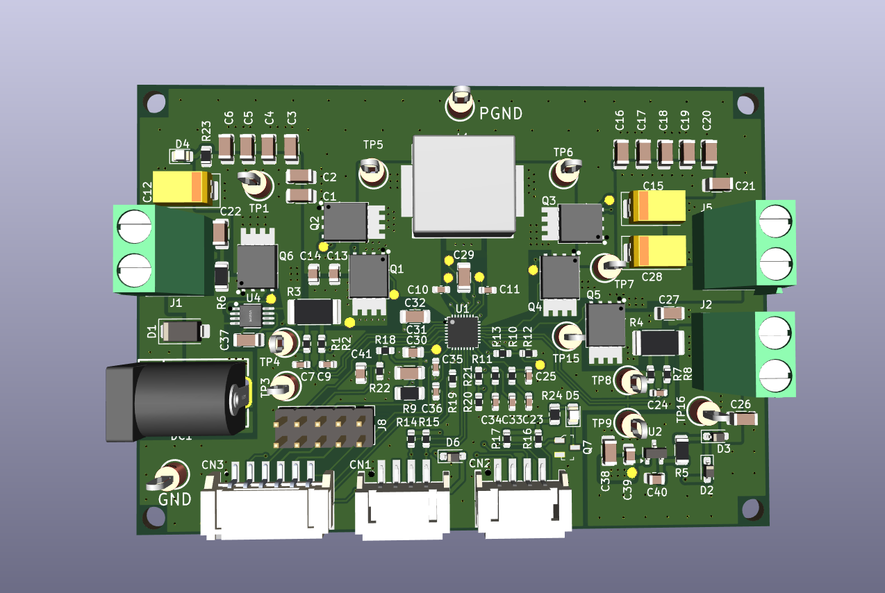
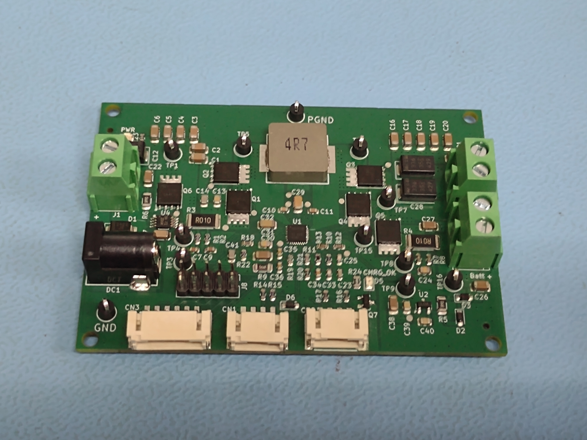
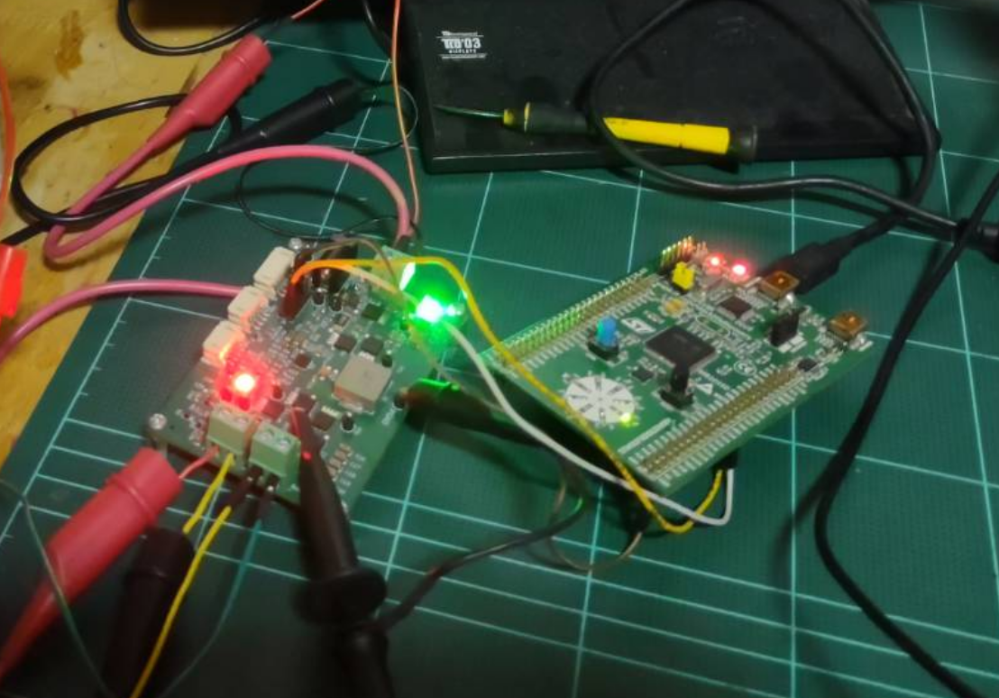

# bms-ti-bq25730-ststm32
BMS board development using BQ25730 chip from Texas Instrument. Testing firmware for host is based on STM32 MCU, using PlatformIO-ststm32 framework.

The project consists of
- `board`\
    KiCAD PCB layout for BMS board and schematic.

- `stm32`\
    BQ25730 C library based on arduino-stst32 (`stm32/lib/bq25730-ststm32`) + STM32F3disco example for BQ25730's host using PlatformIO framework.

### More to do
Add more supported functions for BQ25730 library
- Set charging and discharging current for the battery.
- Current limit and Voltage limit
- Be able to set the charging characteris to the chip based on battery type
- etc.

